# CSS background 的 8种核心技巧

## 背景基础知识

纯色背景

```css
background: #000;
```


线性渐变颜色

```css
background: linear-gradient(#fff, #000);
```

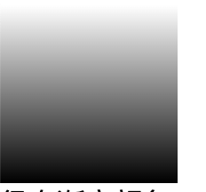

径向渐变颜色

```css
background: radial-gradient(#fff, #000);
```

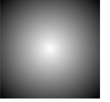

角向渐变颜色

```css
background: conic-gradient(#fff, #000);
```

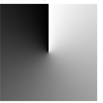

## 技巧一 渐变的颜色可以是透明色（transparent）

```css
background: linear-gradient(#fff, transparent);
```

将背景大的盒子背景颜色设置蓝色，小盒子设置成线性渐变背景色

```html
<div class="demo1-Bigbox">
  <div class="demo1-Smallbox box"></div>
</div>
<style>
.demo1-Bigbox {
  width: 150px;
  height: 150px;
  background-color: skyblue;
}

.demo1-Smallbox {
  background: linear-gradient(#fff, transparent);
}  
</styles>
```


具体的功能实现：

```html
<div class="g-gradient">
   <ul>
     <li>Button</li>
     <li>Button</li>
     <li>Button</li>
     <li>Button</li>
     <li>Button</li>
    </ul>
</div>
<style>
.g-gradient {
    position: relative;
    width: 300px;
    padding: 5px;

    &::before {
      content: "";
      position: absolute;
      right: 0;
      bottom: 0;
      top: 0;
      width: 100px;
      background: linear-gradient(90deg, transparent, #fff);
      pointer-events: none;
    }

    ul {
      width: 264px;
      display: flex;
      flex-wrap: nowrap;
      overflow-x: scroll;
    }

    li {
      margin-right: 12px;
      border: 1px solid #666;
      border-radius: 5px;
      padding: 4px;
      cursor: pointer;

      &:hover {
        background: #666;
        color: #fff;
      }
    }
  }
</style>
```

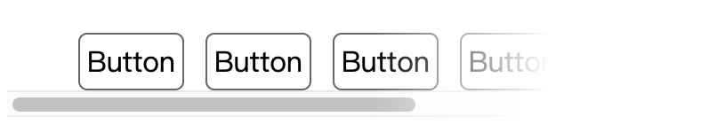


## 技巧二：渐变可以是从一种颜色直接到另外一种颜色

从一个颜色过渡到另外一个颜色，可以渐变过渡，可以直接过渡

```css
{
  border: 2px solid #000;
  background: linear-gradient(#fff 0%, #fff 50%, #f00 50%, #00 100%)
}
```

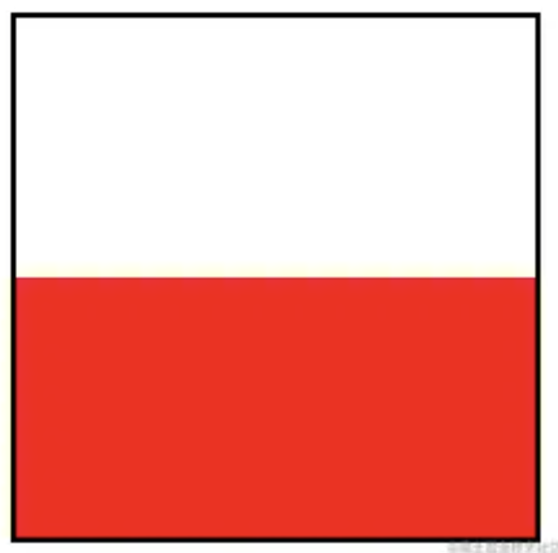

可以实现一个三角形，前50%设置成红色后50%设置成白色，然后给个角度旋转下就是一个三角形

```html
<div class="triangle">
   <div class="box"></div>
</div>
<style>
.triangle {
  .box {
    background: linear-gradient(45deg, #f00 0%, #f00 50%, transparent 50%, transparent 100%);
  }
}
</style>
```

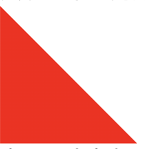

## 技巧三： 渐变是可以叠加多层的

假如一个图形四个角，那都用上面说的做一个三角形

```html
<div class="notching">
   <div class="box"></div>
</div>
<style>
.notching {
  .box {
    width: 200px;
    height: 100px;
    background:
      linear-gradient(135deg, transparent 15px, deeppink 0),
      linear-gradient(-135deg, transparent 15px, deeppink 0),
      linear-gradient(-45deg, transparent 15px, deeppink 0),
      linear-gradient(45deg, transparent 15px, deeppink 0);
    background-size: 50% 50%;
    background-position: top left, top right, bottom right, bottom left;
    background-repeat: no-repeat;
  }
}
</style>
```

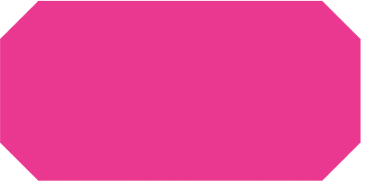

## 技巧四：利用 repeating-linear-gradient 节省代码

使用背景色的时候可以用 **background-repeat: repeat** 进行背景重复。官方还提供了 **repeating-linear-gradient** 可以创建一个有线性渐变组成的图形

```css
{
    background: 
        repeating-linear-gradient(
            45deg, 
            #f06a0e, 
            #f06a0e 11px, 
            transparent 11px, 
            transparent 20px
        );
}
```

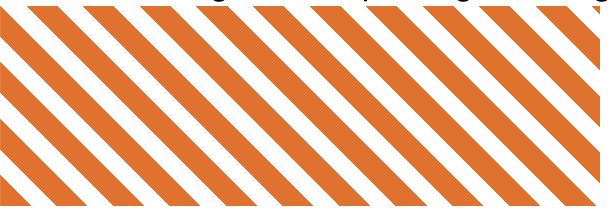

如果不是repeating会是什么场景呢

```css
{
    background: 
        linear-gradient(
            45deg, 
            #f06a0e, 
            #f06a0e 11px, 
            transparent 11px, 
            transparent 20px
        );
}
```


repeating-linear-gradient 做了什么事情呢？其实是按照每 11px 安排一段 #f06a0e，每 9px 安排一段 transparent

不用repeating-linear-gradient 的完整代码

```css
{
    background: 
        linear-gradient(
            45deg, 
            #f06a0e, 
            #f06a0e 11px, 
            transparent 11px, 
            transparent 20px, 
            #f06a0e 20px, 
            #f06a0e 31px, 
            transparent 31px, 
            transparent 40px,
            #f06a0e 40px, 
            #f06a0e 51px, 
            transparent 51px, 
            transparent 60px
        );
}
```

`总结：1.渐变的颜色可以是透明色  2.渐变的颜色可以从一种颜色直接到另外一个颜色不需要过滤  3.渐变是可以叠加多层的  3.渐变是可以叠加多层的  4.利用repeating-linear-gradient 可以节省代码，实现片段的重复 `

`radial-gradient` 径向渐变

## 技巧五：预留衔接空间消除渐变产生的锯齿

使用渐变从一个颜色过渡直接过渡到另外一个颜色，非常容易产生锯齿效果

```css
.demo1 {
  width: 400px;
  height: 400px;
  background: radial-gradient(#9c27b0 0%, #9c27b0 47%, #ffeb3b 47%, #ffeb3b 100%);
}
```

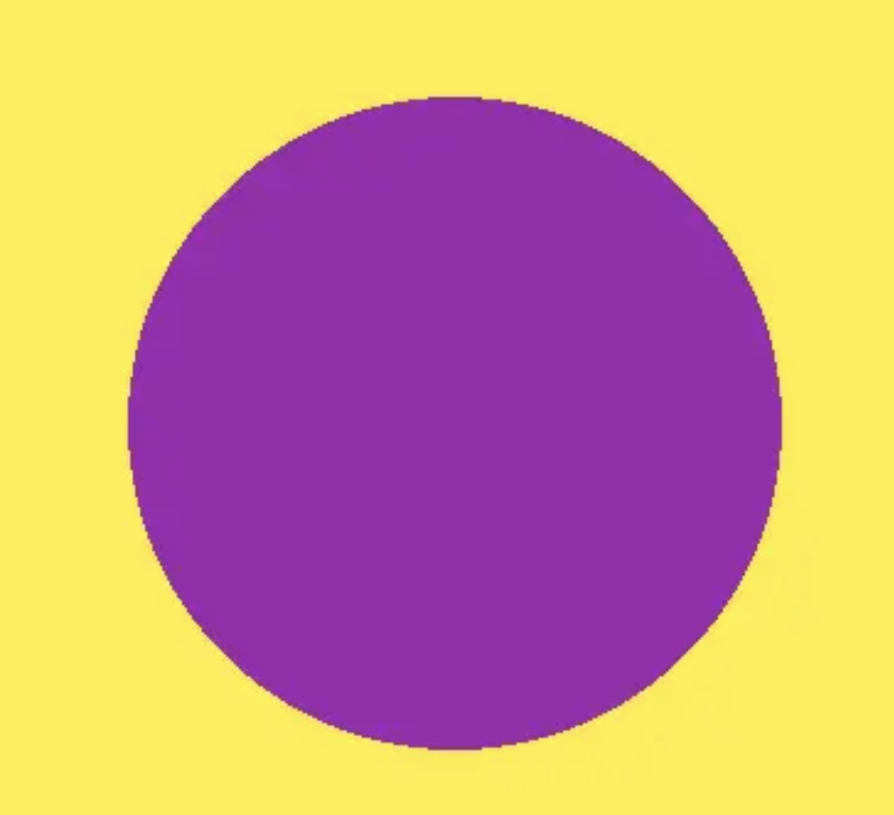

```css
.demo2 {
  width: 400px;
  height: 400px;
  background: radial-gradient(#9c27b0 0%, #9c27b0 47%, #ffeb3b 47.3%, #ffeb3b 100%);
}
```

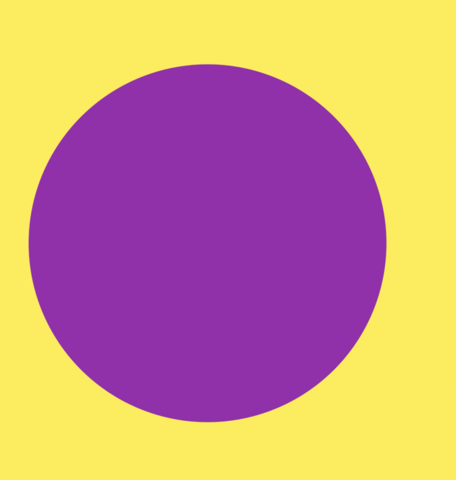

`总结将过渡从 47%到 47.2% 多出来一个0.2%会使锯齿状消失，但是这个过度的多的百分比是不固定的可以根据实际进行调整。`

## 技巧六 利用多层渐变组合图形

是将多个渐变的组合图形合并在一起，能拼出其他的图形，其中的波浪形就是通过两个径向渐变的叠加在一起

```css
  .demo3 {
    position: relative;
    width: 200px;
    height: 100px;
    background: linear-gradient(180deg, #607d8b, #673ab7) rgb(0, 0, 0, .5);
    background-size: 100% 50px;
    background-repeat: no-repeat;
    animation: moveC 10s linear infinite;

    &::before {
      content: "";
      position: absolute;
      left: 0;
      top: 40px;
      right: 0;
      background-repeat: repeat-x;
      height: 10px;
      background-size: 20px 20px;
      background: radial-gradient(circle at 10px- 5px, transparent 12px, #fff 13px, #fff 20px);
    }

    &::after {
      content: "";
      position: absolute;
      left: 0;
      top: 35px;
      right: 0;
      background-repeat: repeat-x;
      height: 15px;
      background-size: 40px 20px;
      background-image: radial-gradient(circle at 10px 15px, white 12px, transparent 13px);
    }
  }
```

`background-image: redial-gradient(circle at 10px 15px) 其中的 circle是圆形的意思 at 10px 15px是渐变起始点位置 `

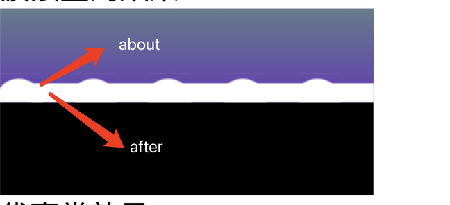

下面是一个波浪形成的原理

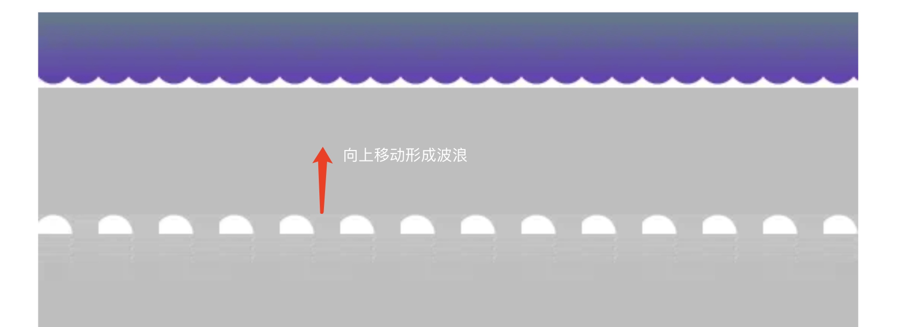


接下来将使用动画配合径向渐变实现文字的动态的波浪线

```html
<div class="flow-wave-demo4">
  <a href="" class="flow-wave">hover me</a>
</div>
<style>
.flow-wave-demo4 {
    position: relative;
    height: 100px;
    .flow-wave {
      position: absolute;
      top: 70%;
      left: 50%;
      transform: translate(-50%, -50%) scale(3);
      font-size: 18px;
      text-decoration: none;
      background: 
        radial-gradient(circle at 10px -7px, transparent 8px, currentColor 8px, currentColor 9px, transparent 9px) repeat-x,
        radial-gradient(circle at 10px 27px, transparent 8px, currentColor 8px, currentColor 9px, transparent 9px) repeat-x;
      background-size: 20px 20px;
      background-position: -10px calc(100% + 16px), 0 calc(100% - 4px);
    }
    .flow-wave {
      padding: 5px 0;
    }
    .flow-wave:hover,
    .flow-wave:focus {
      background: radial-gradient(circle at 10px -7px, transparent 8px, currentColor 8px, currentColor 9px, transparent 9px) repeat-x,
        radial-gradient(circle at 10px 27px, transparent 8px, currentColor 8px, currentColor 9px, transparent 9px) repeat-x;
      background-size: 20px 20px;
      background-position: -10px calc(100% + 16px), 0 calc(100% - 4px);
      animation: waveFlow 1s infinite linear;
    }

    @keyframes waveFlow {
      from { background-position-x: -10px, 0; }
      to { background-position-x: -30px, -20px; }
    }
  }
</style>
```


Conic-gradient 角向渐变（圆锥渐变）

```css
{
    background: conic-gradient(deeppink, yellowgreen);
}
```

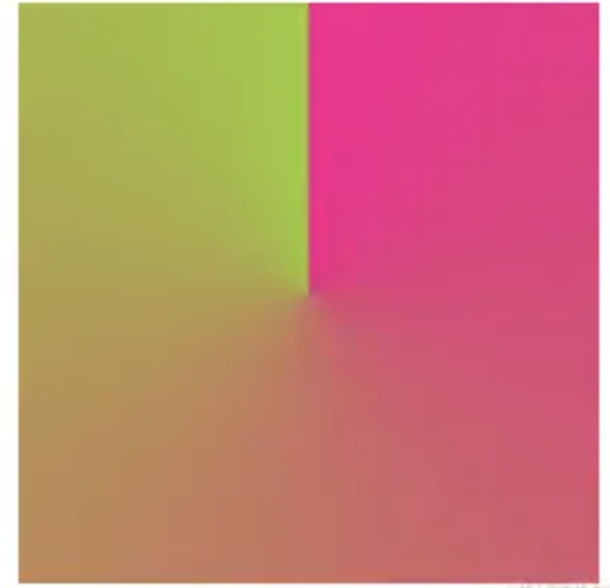

角向渐变从渐变的圆心、渐变起始角度以及渐变方向上来说 如下图

角向渐变的起始是圆心，起始角度和渐变方向为：1.起始点是图形中心，2. 默认角度是从 0deg 是从上方垂直于圆心的。3.渐变方向以顺时针开始饶中心转圈。

`可以改变起始角度以及角向渐变的圆心代码如下：`

```css
{
  background: conic-gradient(from 270deg at 50px 50px, deeppink, yellowgreen)
}
```

> from 后面是初始角度， at 后面是圆心的位置

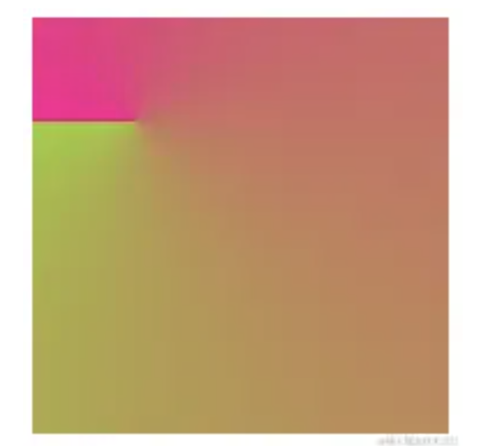
