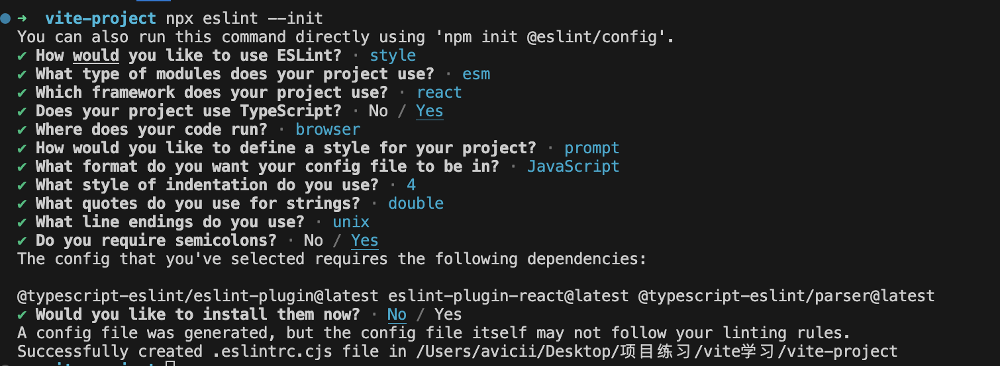

# Vite接入代码规范配置

前端代码的规范插件，常见的有 `ESlint` `Prettier`  还有 `husky`

## JS和TS规范工具：ESlint

eslint的目标就是保证代码的一致性和避免错误

先在现有的项目中下载eslin

```ba
pnpm i eslint -D
```

然后初始化ESlint

```ba
npx eslint --init
```


跟项目根目录下面会生成 `.eslintrc.cjs` 配置文件。

接下来，安装依赖包

```bash
pnpm i eslint-plugin-react@latest @typescript-eslint/eslint-plugin@latest @typescript-eslint/parser@latest -D
```

下面解读 eslint的配置文件

### 1.parser 解析器

因为 eslint底层没有对ts进行解析，所以我们下载 `typescript-eslint/parser`  这个插件会将ts 解析成Espree能够识别的格式。

### 2.parserOptions 解析器选项

ecmaVersion 是指支持的语法 latest的是指最新的es语法， sourceType 如果使用es module就配置 module

### 3. rules 配置规则

```ts
module.exports = {
  "rules": {
    // key 为规则名，value 配置内容
     "no-cond-assign": ["error", "always"]
  }
}
```

value配置的规则，第一项id，id有几个选项可以填，1、off或者0 代表关闭规则;  2、warn或者1 代表是开启规则，只抛出经过，不会退出程序; 3、 error或2 开启规则 违背规则抛出规则，并且停止程序。

也可以直接将rules的对象直接配置成id 如: `"no-cond-assign": "error"`  

### 4. plugins 插件

插件就是使用第三方的插件，比如上面说的 eslint 不能解析ts，我们就添加 `@typescript-eslint/eslint-plugin` 来拓展ts代码规则。

```ts
// .eslintrc.js
module.exports = {
  // 添加 TS 规则，可省略`eslint-plugin`
  plugins: ['@typescript-eslint']
}
```

但是eslint 默认是不会开启校验的，我们需要在rules规则对象里手动开启。

```ts
"rules": {
  "@typescript-eslint/ban-ts-comment": "error",
  "@typescript-eslint/no-explicit-any": "warn"
}
```

### 5. extends 继承配置

extends 相当于继承另外一份eslint 配置。

配置文件可以分为3种情况

1. 从Eslint本身继承；
2. 从类型与 `eslint-config-xxx` 的npm包上继承；
3. 从Eslint插件继承；

有了extends 的配置，相对于之前说的插件要开启，我们就不需要一个个开始插件。通过extends字段即可自动开启插件中的推荐规则，

```ts
extends: ["plugin:@typescript-eslint/recommended"]
```

### 6. env和globals

## eslint 和 prettier配置实现代码风格

prettier做代码风格更加专业点，我们先下载prettier

```bash
pnpm i prettier -D
```

然后在项目根目录下面添加 `.prettierc.cjs` 文件

```js
module.exports = {
  printWidth: 80, //一行的字符数，如果超过会进行换行，默认为80
  tabWidth: 2, // 一个 tab 代表几个空格数，默认为 2 个
  useTabs: false, //是否使用 tab 进行缩进，默认为false，表示用空格进行缩减
  singleQuote: true, // 字符串是否使用单引号，默认为 false，使用双引号
  semi: true, // 行尾是否使用分号，默认为true
  trailingComma: "none", // 是否使用尾逗号
  bracketSpacing: true // 对象大括号直接是否有空格，默认为 true，效果：{ a: 1 }
};
```

然后我们再安装两个依赖包

```bash
pnpm i eslint-config-prettier eslint-plugin-prettier -D
```

eslint-config-prettier是用来覆盖eslint本身的规则配置，而 eslint-plugin-prettier 则是让prettier 接管，eslint --fix 即修复代码的能力。

我们需要再 `.eslintc.cjs`文件中，添加相关配置

```ts
// .eslintrc.js
module.exports = {
  env: {
    browser: true,
    es2021: true
  },
  extends: [
    "eslint:recommended",
    "plugin:react/recommended",
    "plugin:@typescript-eslint/recommended",
    // 1. 接入 prettier 的规则
    "prettier",
    "plugin:prettier/recommended"
  ],
  parser: "@typescript-eslint/parser",
  parserOptions: {
    ecmaFeatures: {
      jsx: true
    },
    ecmaVersion: "latest",
    sourceType: "module"
  },
  // 2. 加入 prettier 的 eslint 插件
  plugins: ["react", "@typescript-eslint", "prettier"],
  rules: {
    // 3. 注意要加上这一句，开启 prettier 自动修复的功能
    "prettier/prettier": "error",
    quotes: ["error", "single"],
    semi: ["error", "always"],
    "react/react-in-jsx-scope": "off"
  }
};
```

然后再 package.json 里面配置自定义脚本

```bash
"lint:script": "eslint --ext .js,.jsx,.ts,.tsx --fix --quiet ./src"
```

在 vite里面接入 eslint

首先下载 `pnpm i vite-plugin-eslint -D`  然后再vite.config.ts 文件里接入

```ts
// vite.config.ts
import viteEslint from 'vite-plugin-eslint';

// 具体配置
{
  plugins: [
    // 省略其它插件
    viteEslint(),
  ]
}

```

## 样式规范工具 Stylelint

stylelint主要是专注于样式代码的规范检查，但是在代码格式化方面还是需要和prettier结合一起操作

首先我们先下载 stylelint 以及相对应的工具配套

```bash
pnpm i stylelint stylelint-prettier stylelint-config-prettier stylelint-config-recess-order stylelint-config-standard stylelint-config-standard-scss -D
```

然后我们在 stylelint 配置文件 `.stylelintrc.js` 中进行相关配置

```ts
// .stylelintrc.js
module.exports = {
  // 注册 stylelint 的 prettier 插件
  plugins: ["stylelint-prettier"],
  // 继承一系列规则集合
  extends: [
    // standard 规则集合
    "stylelint-config-standard",
    // standard 规则集合的 scss 版本
    "stylelint-config-standard-scss",
    // 样式属性顺序规则
    "stylelint-config-recess-order",
    // 接入 Prettier 规则
    "stylelint-config-prettier",
    "stylelint-prettier/recommended"
  ],
  // 配置 rules
  rules: {
    // 开启 Prettier 自动格式化功能
    "prettier/prettier": true
  }
};
```

然后再package.json 中添加自定义脚本

```bash
 "scripts": {
    "lint": "npm run lint:script && npm run lint:style",
    "lint:style": "stylelint --fix \"src/**/*.{css,scss}\""
  },
```

我们也可以在vite中个集成使用stylelint ，实现在开发阶段发现样式代码问题。

安装下面插件

```bash
# Vite 2.x
pnpm i @amatlash/vite-plugin-stylelint -D

# Vite 3.x 及以后的版本
pnpm i vite-plugin-stylelint -D
```

然后再vite.config.ts中配置

```ts
import viteStylelint from '@amatlash/vite-plugin-stylelint';
// 注意: Vite 3.x 以及以后的版本需要引入 vite-plugin-stylelint

// 具体配置
{
  plugins: [
    // 省略其它插件
    viteStylelint({
      // 对某些文件排除检查
      exclude: "node_modules/**"
    }),
  ]
}
```

## Husky  + lint-staged的git提交工作流集成

### 提交前代码的lint检查

husky插件主要就是在我们提交代码之前帮我们执行脚本进行代码的规范校验，也可以对commit 信息校验。

下载工具包

```bash
pnpm i husky -D
```

下面是husky 4.x版本之后的做法

1. 先初始化 Husky: `npx husky install` ,并将 `husky install` 作为项目启动前的脚本，

   ```json
   {
     "scripts": {
       // 会在安装 npm 依赖后自动执行
       "prepare": "husky install"
     }
   }
   ```

2. 添加 husky钩子，在终端执行

   ```bash
   npx husky add .husky/pre-commit "npm run lint"
   ```

   这个时候可以在项目根目录的.husky 文件夹中看到名为`pre-commit` 的文件，里面包含了 git commit 前要执行的脚本, `npm run lint`  ,但是这个脚本会将整个项目的代码都会校验一遍，这个过程是很浪费时间，所以我们安装 `lint-staged` 这个插件只会校验在暂存区的代码，这样会大大提升了提交代码的效率，下面我们安装相对应的npm 包

   ```bash
   pnpm i -D lint-staged
   ```

   然后再 package.json 中添加如下脚本

   ```json
   {
     "lint-staged": {
       "**/*.{js,jsx,tsx,ts}": [
         "npm run lint:script",
         "git add ."
       ],
       "**/*.{scss}": [
         "npm run lint:style",
         "git add ."
       ]
     }
   }
   ```

   然后我们在 husky应用中添加 lint-staged，打开`.husky/pre-commit` 文件，将`npx --no -- lint-staged`  替换掉 `npm -run lint`

   ### 提交时commit信息的规范

   除了正常的代码检查，git提交信息也是重要的环节，我们将对commit 信息做规范配置，下面安装依赖包

   ```bash
   pnpm i commitlint @commitlint/cli @commitlint/config-conventional -D
   ```

   接下来 新建 `.commitlintrc.js`

   ```js
   // .commitlintrc.js
   module.exports = {
     extends: ["@commitlint/config-conventional"]
   };
   ```

   规范的commit的信息是如下组成部分

   ```js
   // type 指提交的类型
   // subject 指提交的摘要信息
   <type>: <subject>
     
   常见的 type值如下
   feat: 添加新功能。
   fix: 修复 Bug。
   chore: 一些不影响功能的更改。
   docs: 专指文档的修改。
   perf: 性能方面的优化。
   refactor: 代码重构。
   test: 添加一些测试代码等等。
   ```

   下面我们将  commitlint 的功能集成到 husky的钩子中，如下是终端执行的命令

   ```bash
   npx husky add .husky/commit-msg "npx --no-install commitlint -e $HUSKY_GIT_PARAMS"
   ```

   这样就完成了 commit 的规范配置
