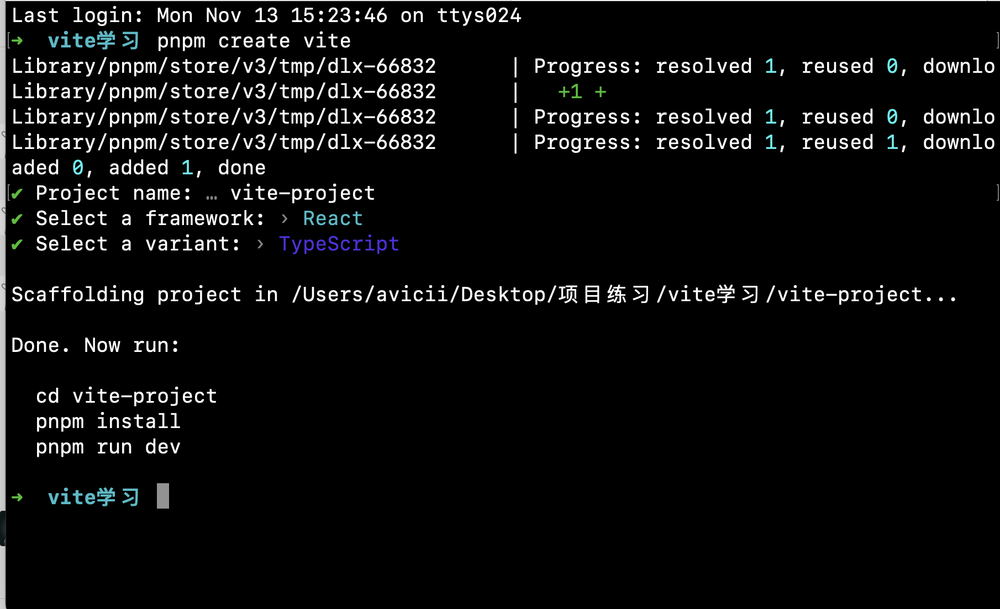
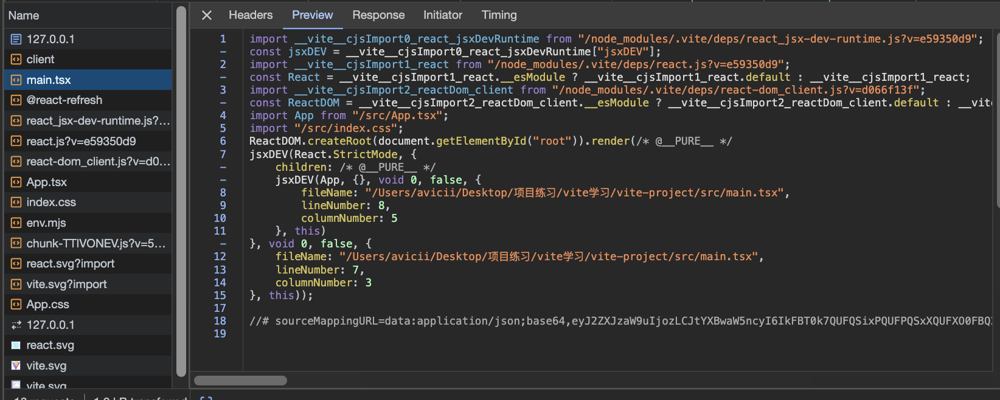

# 用vite搭建一个项目

## 环境

这边我使用pnpm 搭建项目，首先下载pnpm

```js
npm i -g pnpm
```

设置国内镜像

```bash
pnpm config set registry https://registry.npmmirror.com/
```

## 项目初始化

```bash
pnpm create vite
```



## 入口文件

启动项目

```js
pnpm run dev
```

我们发现在项目的根目录下面有一个 index.html的文件

```html
<!DOCTYPE html>
<html lang="en">
  <head>
    <meta charset="UTF-8" />
    <link rel="icon" type="image/svg+xml" href="/src/favicon.svg" />
    <meta name="viewport" content="width=device-width, initial-scale=1.0" />
    <title>Vite App</title>
  </head>
  <body>
    <div id="root"></div>
    <script type="module" src="/src/main.tsx"></script>
  </body>
</html>
```

我们发现有个script标签，声明了一个 `type="module"` 的script标签：

```js
 <script type="module" src="/src/main.tsx"></script>
```

这个标签的写法是根据新的ES模块规范，可以直接放在浏览器中执行的，src指向 `/src/main.tsx` 文件，这个语法相当于请求了  `http://localhost:3000/src/main.tsx`这个资源。vite的dev server 此时会接收这个请求，然后读取相对应的文件并且返回给浏览器。

我们再看下 main.tsx

```tsx
import React from 'react'
import ReactDOM from 'react-dom/client'
import App from './App.tsx'
import './index.css'

ReactDOM.createRoot(document.getElementById('root')!).render(
  <React.StrictMode>
    <App />
  </React.StrictMode>,
)
```

文件里面的内容是不会被浏览器认识，但是vite会在中间做个处理，我们可以在浏览器中查看



我们发现vite把解析成浏览器看得懂的代码，同时一个import 代表一个http请求。在后面的文件中，只要有个import就是一个请求，直到所有文件加载完毕。

到现在我们应该清楚，**vite 是根据浏览器原生的ES模块支持，实现在开发阶段的Dev server，进行模块的按需加载，不用完全打包发版，**这就是比webpack快的一个原因。

## 配置文件

配置文件主要是在 `vite.config.ts` 文件中进行配置

```ts
import { defineConfig } from 'vite'
import react from '@vitejs/plugin-react'

export default defineConfig({
  plugins: [react()]
})
```

可以看到在 plugins数组中有个react 的插件，这个是vite的官方插件，用来react项目的编译和热更新。

