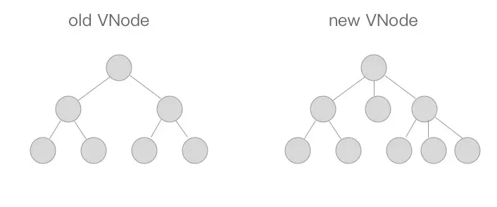

# 一、数据状态更新时的差异diff以及path机制

## API方法介绍

1. insert 用来在  parent 父节点下面 插入一个子节点，如果指定了ref 则插入到ref这个节点之前

   ```js
   function insert (parent, elm, ref) {
       if (parent) {
           if (ref) {
               if (ref.parentNode === parent) {
                   nodeOps.insertBefore(parent, elm, ref);
               }
           } else {
               nodeOps.appendChild(parent, elm)
           }
       }
   }
   ```

2. createElm 用来新建一个节点， tag存在创建一个标签节点，否则创建一个文本节点

   ```js
   function createElm (vnode, parentElm, refElm) {
       if (vnode.tag) {
           insert(parentElm, nodeOps.createElement(vnode.tag), refElm);
       } else {
           insert(parentElm, nodeOps.createTextNode(vnode.text), refElm);
       }
   }
   ```

3. addVnodes 用来批量调用createElm 新建节点

   ```js
   function addVnodes (parentElm, refElm, vnodes, startIdx, endIdx) {
       for (; startIdx <= endIdx; ++startIdx) {
           createElm(vnodes[startIdx], parentElm, refElm);
       }
   }
   ```

4. remove 用来移除一个节点

   ```js
   function removeNode (el) {
       const parent = nodeOps.parentNode(el);
       if (parent) {
           nodeOps.removeChild(parent, el);
       }
   }
   ```

5. removeVnodes 会批量调用 removeNode 移除节点

   ```js
   function removeVnodes (parentElm, vnodes, startIdx, endIdx) {
       for (; startIdx <= endIdx; ++startIdx) {
           const ch = vnodes[startIdx]
           if (ch) {
               removeNode(ch.elm);
           }
       }
   }
   ```

## patch

path的核心就是diff算法，我们用diff算法可以对比出两个虚拟数的差异

diff算法是通过同层的树节点进行比较而非进行逐层遍历的方式，所以时间复杂度只是O(n)，是一种相当高效的算法。



path主要的功能就是对比两个节点，将差异更新到视图上。

首先在oldVnode 不在存在时候，相当于newVnode代替本来没有的节点直接同 addVnodes 函数将这些节点批量添加到parentElm 上。

同样在newVnode不存在的时候，相当于要把老的节点删除掉，直接用removeVnodes进行批量的节点删除即可。

最后一种情况，当oldVnode与newVnode都存在的时候，需要判断他们是否属于sameVnode，如果是则进行pathVnode对比Vnode操作。否则删除老节点。
