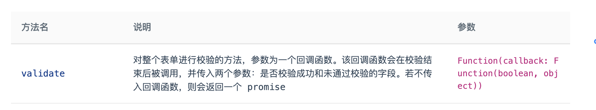

# vue工作踩坑

## 1. vue项目中表单的循环校验

在项目中我们可能碰到 表单是用遍历显示出来的，所以我们在校验的时候会碰到跟传统单个表单不同的逻辑。



这个方法在很多vue的组件库form表单校验都存在，我们不传入回调函数他会自己返回一个promise，我们利用这一点。集合Promise.all的方法，这样这样所有的表单校验都通过了Promise.all 才会返回成功。

```js
const refsList = this.form.componentList.map((item,index) => this.$refs['rulesForm'+index].validate)
const res = Promise.all(refsList)
// res 是一个promise
```

